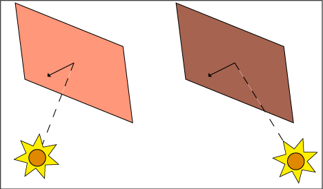
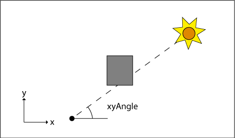
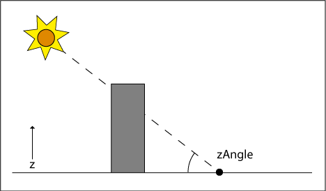
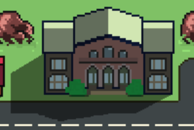
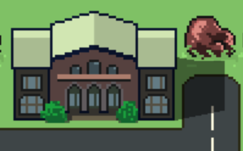

I'm working on a stealth action game where shadows will play a big role in the gameplay. Using WebGL shaders, I implemented dynamic lighting and shadows. This post is the blog post I wish existed before I started :) Gritty details on how I implemented these below...

<span class="more"></span>

<iframe width="560" height="315" style="margin-top: 3em; margin-bottom: 3em;" src="http://www.youtube.com/embed/ZMyg5erp-vk" frameborder="0" allowfullscreen></iframe>

##Part one: dynamic lighting
I was inspired by [this post](http://www.reddit.com/r/gamedev/comments/115f3y/how_to_dynamic_lighting_on_sprites/) on Reddit, where aionskull used normal maps in Unity to dynamically light up his sprites. gpillow also posted in the comments how he had done [something similar](https://love2d.org/forums/viewtopic.php?f=5&t=11076) in Love2D. [Here's a large gif illustrating gpillow's results](pixel_shading.gif). I'd just include the gif here, but it's 8 megs. Thanks to jusksmit for making the gif.

So, what is dynamic lighting? It's a 3D graphics technique where a light source lights up objects in the scene. It's dynamic as the lighting effects update in real time as the light source moves around. This is pretty standard stuff in the 3D world and easy to translate into a 2D environment, assuming you can take advantage of shaders.

The key is the angle the light hits a surface indicates how much the surface lights up.
		


and the key to *that* is the normal vector. A vector which indicates which way a surface is facing. In the above diagram, the arrow sticking out of the center of the panel is the normal vector. You can see that when the light's rays come in at a shallower angle, the panel is less influenced by the light and not lit up as much. So in the end, the algorithm is quite simple, as that angle increases, have the light source influence less. A simple way to calculate the influence is to calculate the dot product between the light vector and the normal vector.
###dynamic lighting in a 2d environment
That's all well and good, but how do you have normal vectors in a 2d game? There aren't any real 3D objects in the traditional sense, but textures can step in to provide the needed info. I created *normal maps* for the two houses in the above video, and use them to calculate the lighting:


For starters, you can see the actual house sprite has no shading drawn into it. Then the normal map encodes the normals for each pixel into a color. A vector needs to be specified with (x,y,z) coordinates, and an image has r,g and b values. So the encoding into the image is easy to do. Take the front face of the house, which is facing due south giving the normal vector values of `[x:0, y:0.5, z:0]`. RGB values are positive, so need to shift the values up by 0.5 to force everything positive:  `[x:0.5, y:1, z:0.5]`. And RGB values are normally represented as bytes, so multiply each value by `255`, yielding (rounded up): `[x:128, y:255, z:128]`, or in other words, this bright green <span style="display:inline-block; width: 30px; height: 15px; background-color: rgb(128, 255, 128)">&nbsp;</span>, the same green in the normal map image.

With our normals in tow, we're ready to have the graphics card do its magic. My game is using [ImpactJS](http://www.impactjs.com), which is very compatibile with [WebGL2D](https://github.com/gameclosure/webgl-2d) Using WebGL2D, it was easy to add an additional fragment shader to implement the lighting:

```c
#ifdef GL_ES
  precision highp float;
#endif

varying vec2 vTextureCoord;
uniform sampler2D uSampler;
uniform vec3 lightDirection;
uniform vec4 lightColor;
  
void main(void) {
  // pull the normal vector out of the texture
  vec4 rawNormal = texture2D(uSampler, vTextureCoord);

  // if the alpha channel is zero, then don't do lighting here
  if(rawNormal.a == 0.0) {
    gl_FragColor = vec4(0, 0, 0, 0);
  } else {

    // translate from 0 to 1 to -.5 to .5
    rawNormal -= 0.5;

    // figure out how much the lighting influences this pixel
    float lightWeight = 
      dot(normalize(rawNormal.xyz), normalize(lightDirection));

    lightWeight = max(lightWeight, 0.0);

    // and drop the pixel in
    gl_FragColor = lightColor * lightWeight;
  }
}
```

Couple final points here. This is *per fragment lighting*, which is a bit different from per vertex lighting. Since the vertices are completely
irrelevant in 2D rendering (just 4 vertices to drop the texture into the scene), have no choice but to do per fragment lighting. No problem, per
fragment lighting is more accurate anyway. Also this shader is only rendering the light itself. It assumes the main sprite has already been drawn. I have to admit I am cheating a little bit, as I am setting my `lightColor` to a dark grey, and not sending out light but actually darkness. This
is because lighting the pixels up makes them looked washed out. There are ways to resolve this, but for now I'm cheating a smidge.


##part two: casting shadows
Casting shadows in 3D environments is a well solved problem, using techniques like [raytracing](http://en.wikipedia.org/wiki/Ray_tracing_(graphics)) or [shadow mapping](http://en.wikipedia.org/wiki/Shadow_mapping) casting shadows in the scene is pretty easy to accomplish. I struggled to find an implementation in my 2D environment that I was happy with. I think I came up with a good solution, but for sure it has drawbacks.

In short, draw a line from a fragment (aka pixel) in the scene to the sun and see if anything gets in the way. if something does, that pixel is in the shade, else it's in the sun. In the end it's actually pretty simple.

The shader will get `xyAngle` and `zAngle` passed into it, indicating where the sun is. Since the sun is so far away, these two angles are the same for all pixels, as sunrays are effectively parallel to each other.

The other key piece of info the shader receives is the *height map* for the world. This height map indicates how tall everything is, buildings, trees, etc. If a pixel is occupied by a building, then that pixel's value will be something like 10, to indicate that building is 10 pixels tall.

So starting at the current pixel and using `xyAngle`, we move over just a bit towards the sun in the x/y direction. Using the height map, we figure out how tall the pixel is at this location. If the pixel here is the same height or lower, then we keep moving towards the sun until we find a pixel that is taller than the current pixel.



Once we find a pixel that has some height to it, we need to see if it's tall enough to block the sun. Using `zAngle`, we determine how tall this pixel needs to be to block the sun:



If it is tall enough, we are done, this pixel is in the shade. Otherwise we keep going. Eventually we give up and declare the pixel to be in the sun (currently I have that hard coded to 100 steps, which so far is working well)

Here is the code for the shader in simplified/pseudo form

```c
void main(void) {
  float alpha = 0.0;
  
  if(isInShadow()) {
    alpha = 0.5;
  }
  gl_FragColor = vec4(0, 0, 0, alpha);
}

bool isInShadow() {
  float height = getHeight(currentPixel);
  float distance = 0;

  for(int i = 0; i < 100; ++i) {
    distance += moveALittle();

    vec2 otherPixel = getPixelAt(distance);
    float otherHeight = getHeight(otherPixel);
    
    if(otherHeight > height) {
      float traceHeight = getTraceHeightAt(distance);
      if(traceHeight <= otherHeight) {
        return true;
      }
    }
  }
  return false;
}
```

And here is the whole shebang:

```c
#ifdef GL_ES
  precision highp float;
#endif

vec2 extrude(vec2 other, float angle, float length) {
  float x = length * cos(angle);
  float y = length * sin(angle);

  return vec2(other.x + x, other.y + y);
}

float getHeightAt(vec2 texCoord, float xyAngle, float distance,
    sampler2D heightMap) {

  vec2 newTexCoord = extrude(texCoord, xyAngle, distance);
  return texture2D(heightMap, newTexCoord).r;
}

float getTraceHeight(float height, float zAngle, float distance) {
  return distance * tan(zAngle) + height;
}

bool isInShadow(float xyAngle, float zAngle, sampler2D heightMap,
    vec2 texCoord, float step) {

  float distance;
  float height;
  float otherHeight;
  float traceHeight;

  height = texture2D(heightMap, texCoord).r;

  for(int i = 0; i < 100; ++i) {
    distance = step * float(i);
    otherHeight = getHeightAt(texCoord, xyAngle, distance, heightMap);

    if(otherHeight > height) {
      traceHeight = getTraceHeight(height, zAngle, distance);
      if(traceHeight <= otherHeight) {
        return true;
      }
    }
  }

  return false;
}

varying vec2 vTextureCoord;
uniform sampler2D uHeightMap;
uniform float uXYAngle;
uniform float uZAngle;
uniform int uMaxShadowSteps;
uniform float uTexStep;

void main(void) {
  float alpha = 0.0;

  if(isInShadow(uXYAngle, uZAngle, uHeightMap, uMaxShadowSteps,
     vTextureCoord, uTexStep)) {

    alpha = 0.5;
  }

  gl_FragColor = vec4(0, 0, 0, alpha);
}
```

The `uTexStep` uniform is how far to move over each time we check a nearby pixel. This is set to either `1/heightMap.width` or `1/heightMap.height` before invoking the shader. This is because textures in OpenGL are typically mapped from 0 to 1, so the inverse is how far to move to get to the next pixel.

###shadow wrap up
Truth be told there are some minor details I'm leaving out in the above code, but the core idea is definitely there. One major problem with this approach is each pixel in the scene can only have one height. A good example of how this is a limitation is trees. I can tell the engine to cast a really low, long shadow for a tree, but the trunk will never show up in the shadow. This is because the overhang area at the bottom of the leaves is not recorded in the height map.
	
  



