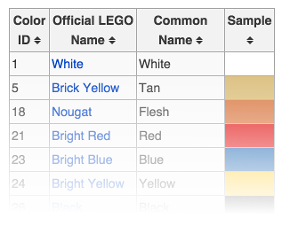

The JavaScript console and the DOM API can be your friend when you need to grab some data from a website.
<span class="more"></span>

I am working on a little toy project involving Legos. I needed to gather all colors available for bricks into a JavaScript object, something like this:

```javascript
var brickColors = {
  "Medium Blue": {
    id: 102,
    color: "rgb(71, 140, 198)"
  },
  "Sand Blue": {
    id: 135,
    color: "rgb(94, 116, 140)"
  },
  ...
};
```

The colors are freely available on the web, such as [here on Brickipedia](http://lego.wikia.com/wiki/Color_Palette), but man, there's a lot of them and it's pretty darn tedious to copy and paste each color's properties over into my editor.



I'll have JavaScript do the work for me, pop open the console and begin with ...

```javascript
document.querySelectorAll('tr')
```

is a good start. It grabs all the table rows on the page.

From there, I turn the result into an array since querySelectorAll returns a `StaticNodeList`, and then filter it down to rows that have four cells, as it turns out the two tables with only three cells per row I don't care about

```javascript
[].slice.call(document.querySelectorAll('tr'))
  .filter(function(tr) { return tr.children.length === 4; })
```

Actually I don't care about the header rows either, so filter them out too

```javascript
[].slice.call(document.querySelectorAll('tr'))
  // use nodeName to only grab <td>s, ignoring the <th>s
  .filter(function(tr) {
    return tr.children.length === 4 &&
           tr.children[0].nodeName === "TD";
  })
```

<div class="callout pitfall">
I got really lucky here, on some webpages narrowing down your query to just the relevant data can be tricky. You'll usually need a much more clever query for `querySelectorAll`
</div>

from here, each `<td>` child inside of the `<tr>` contains a piece of data I want. So I can `reduce` the whole shebang into an object

```javascript
[].slice.call(document.querySelectorAll('tr'))
  .filter(function(tr) {
    return tr.children.length === 4 &&
           tr.children[0].nodeName === "TD";
  })
  .reduce(function(accum, tr) {
    // fallback to the official name if the color lacks a common name
    accum[tr.children[2].innerText || tr.children[1].innerText] = {
      id: Number(tr.children[0].innerText),
      officialName: tr.children[1].innerText,
      color: tr.children[3].style.backgroundColor
    };
    return accum
  }, {});
  ```

That gets me the data I want, but I can't quite paste it into my editor yet. `JSON.stringify` will help through

```javascript
colors = [].slice.call(document.querySelectorAll('tr'))
  .filter(...)
  .reduce(...);

JSON.stringify(colors);
```

Giving me

```JSON
{"White":{"id":1,"officialName":"White","color":"rgb(255, 255, 255)"},"Tan":{"id":5,"officialName":"Brick
Yellow","color":"rgb(217, 187, 123)"},"Flesh":{"id":18,"officialName":"Nougat","color":"rgb(214, 114,
64)"},"Red":{"id":21,"officialName":"Bright Red","color":"rgb(222, 0,
13)"},"Blue":{"id":23,"officialName":"Bright Blue","color":"rgb(0, 87,
168)"},"Yellow":{"id":24,"officialName":"Bright Yellow","color":"rgb(254, 196,
0)"},"Black":{"id":26,"officialName":"Black","color":"rgb(1, 1, 1)"},"Green":{"id":28,"officialName":"Dark
Green","color":"rgb(0, 123, 40)"},"Bright Green":{"id":37,"officialName":"Bright Green","color":"rgb(0, 150,
36)"},"Dark Orange":{"id":38,"officialName":"Dark Orange","color":"rgb(168, 61, 21)"},"Medium
Blue":{"id":102,"officialName":"Medium Blue","color":"rgb(71, 140,
198)"},"Orange":{"id":106,"officialName":"Bright Orange","color":"rgb(231, 99,
24)"},"Lime":{"id":119,"officialName":"Bright Yellowish-Green","color":"rgb(149, 185,
11)"},"Magenta":{"id":124,"officialName":"Bright Reddish Violet","color":"rgb(156, 0, 107)"},"Sand
Blue":{"id":135,"officialName":"Sand Blue","color":"rgb(94, 116, 140)"}

...
```

Then just copy and paste the entire result of the stringify into my code, have my editor format it, and that's it. Much easier than tediously copying each color over, and a little fun too.

<div class="callout wisdom">
You can also have `stringify` format the result for you buy making use of the [space argument](https://developer.mozilla.org/en-US/docs/Web/JavaScript/Reference/Global_Objects/JSON/stringify#space_argument). `JSON.stringify(colors, null, 2)` will format the resulting string nicely.
</div>
